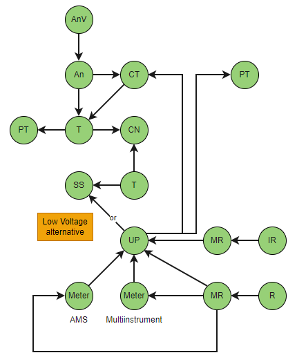
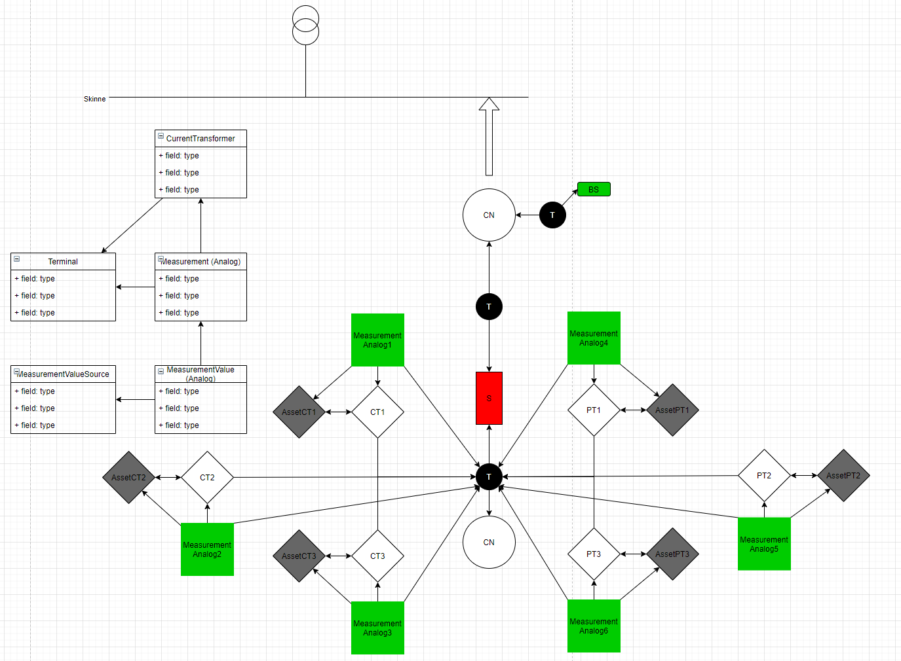
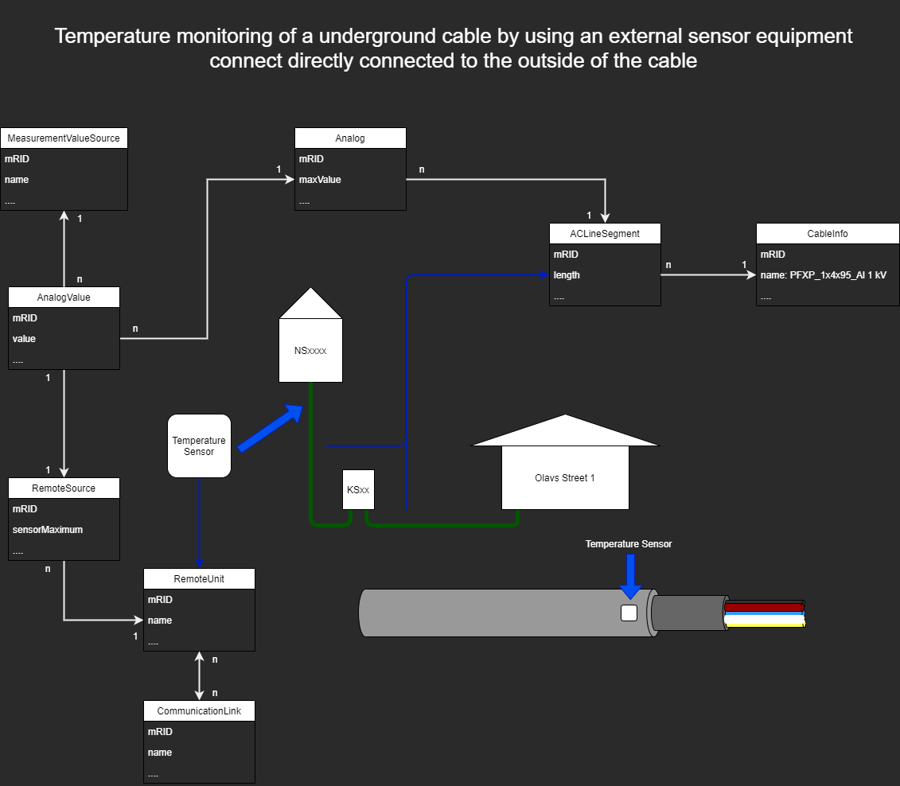

= MeasurementValue and MeterReading specifications
:figure-caption!:

*Version:* 2.1

These are two models in CIM to handle time series. MeterReading is normally related to AMI (AMS) and MeasurementValue is normally related to Scada and EMS/DMS/ADMS.

Measurement provides structural data for both MeasurementValue and MeterReading. The current version does not fully support this for retail customers. This is done to be aligned with the idea that low voltage does not include all details (simplified model).
DIGIN10-AMI-1/2 has tried to align some examples to how the AMI suppliers have modelled time series data.

All time series data are expressed in JSON syntax and structure data are expressed in CIM/XML (RDF/XML) syntax.
The current profiles are defined as XSD using XML syntax, however, the standarization groups are moving more towards supporting JSON Schema and JSON syntax.
DIGIN has chosen to use JSON for all scheduled data (time series) becasue most implementations will be new and JSON supports REST APIs in a more effiecent manner than XML since it requires less coding and has a smaller size.
JSON is also requested by vendors and seems more modern and popular. DIGIN also plans to support JSON-LD as an alternative to CIM/XML (IEC61970-552) for structural data.

[#ref-MeterReading]
== MeterReading: 
=== We have examples for: 

- IntervalReading (periodic value) for PowerTransformer forward and reverse for both reactive and active energy (4 quadrants) (JSON timeseries)
- Reading (accumulated value) for PowerTransformer forward and reverse for both reactive and active energy (4 quadrants) (JSON timeseries)
- Reading for Earth Fault Current. The example is related to a retail customer (JSON timeseries)
- ReadingType as reference data (CIM/XML)
- ReadingQuality as reference data (CIM/XML)
- UsagePoint in current version is only for connecting meter data to ConductingEquipment (CIM/XML)
- Meter as Asset for including the Meter data and Meter related data (Will be complemented in later versions. An example is MeterMultiplier) (CIM/XML)
- DIGIN-AMI-1: The use of MeterReading for retail customer. Then we use UsagePoint and ConformLoad (CIM/XML). Examples are shown in link:../Schedule/2022/03/30/20220330T230000Z_IntervalReading_4Quadrants_2_CU.json[DIGIN-AMI-1-1], link:..Schedule/2022/03/30/20220330T230000Z_Reading_Energy_4Quadrants_2_CU.json[DIGIN-AMI-1-2] and link:../Schedule/2022/03/30/20220330T230000Z_Reading_EarthFault_2.json[DIGIN-AMI-1-3]
- link:../Asset/DIGIN10-30-MV1_CU.xml[DIGIN-AMI-2]: The use of MeterReading in a Substation when you have not modelled CurrentTransformer and/or PotentialTransformer. Then we use UsagePoint and StationSupply (CIM/XML)
- link:../Asset/DIGIN10-30-MV1_CU.xml[DIGIN-AMI-2]: The use of MeterReading in a Substation when you have modelled CurrentTransformer and PotentialTransformer. Then we use UsagePoint and CurrentTransformer and/or PotentialTransformer (CIM/XML)

==== Modeling of the DIGIN-AMI-x examples is shown in the figure below:

*Figure abbreviations:*
--
[cols="1,1", width=100%]
[#tab:abbr_meterReadingFigure] 
|===
|*Abbreviation*    |*Description*
|An | Analog 
|AnV | AnalogValue
|CN | ConnectivityNode
|CT | CurrentTransformer
|IR | IntervalReading
|MR | MeterReading
|PT | PotentialTransformer
|R | Reading
|SS |StationSupply
|T |Terminal
|UP | UsagePoint
|===
--

=== Future plans for MeterReading: 

- Include EndDeviceEvents as time series and EndDeviceEventTypes as reference data
- MeterReading connected to ELHub

== MeasurementValue:
[#ref-MeasurementValue]
=== We have examples for: 

- link:..\Schedule\2022\03\30\20220330T230000Z_Analog_ActivePower_2.json[DIGIN-Meas-1]: Analog and AnalogValue for Three Phase Active Power for a PowerTransformer in a Substation. We measure this at the Breakers Terminal (JSON timeseries)
- link:..\Schedule\2022\03\30\20220330T230000Z_Analog_Current_1.json[DIGIN-Meas-1]: Analog and AnalogValue for Phase Current for a PowerTransformer in a Substation. We measure this at the Breakers Terminal. This is related to a CurrentTransformer (JSON timeseries)
- link:../Schedule/2022/03/30/20220330T230000Z_Analog_CableTemperature_1.json[DIGIN-Meas-2]: Analog and AnalogValue for IoT temperature sensor data
- link:../Schedule/2022/03/30/20220330T230000Z_Discrete_SwitchPosition_1.json[DIGIN-Meas-3]: Discrete and DiscreteValue for switch position data
- link:../Schedule/2022/03/30/20220330T230000Z_Analog_OilTemperature_1.json[DIGIN-Meas-4]: AnalogValue for PowerTransformer oil temperature
- Asset for CurrentTransformer and PotentialTransformer to have an example for relating Measurement to an Asset (CIM/XML). Several of the examples show this.
- Analog (CIM/XML)
- AnalogValue (CIM/XML)
- Discrete (CIM/XML)
- DiscreteValue (CIM/XML)
- MeasurementValueSource as reference data (CIM/XML)
- CurrentTransformer and PotentialTransformer (CIM/XML)

==== Modeling of the DIGIN-Meas-x examples are shown in the figures below:

*Figure abbreviations:*
--
[cols="1,1", width=100%]
[#tab:abbr_measurementFigure] 
|===
|*Abbreviation*    |*Description*
|CN |ConnectivityNode
|CT | CurrentTransformer
|PT | PotentialTransformer
|S |Switch
|T |Terminal
|===
--

=== Future plans for Measurement: 

- Measurement connected to IoT (Internet of things in the form of sensor data)
- Measurement connected to ICCP (old Elkom)
- MeasurementValueQuality

