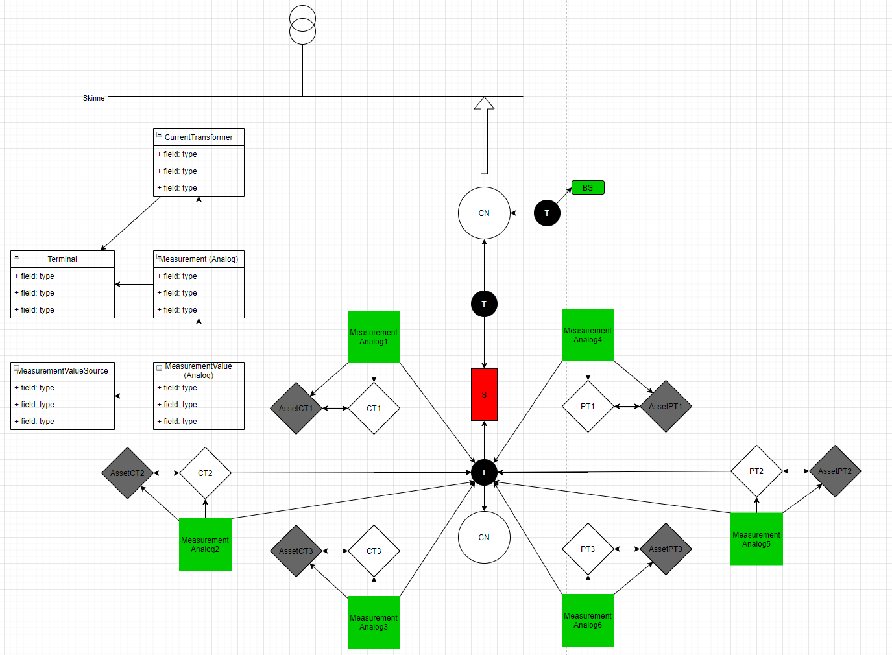

= Measurement and MeterReading specifications

*Version:* 2.1

[red]#When to use Measurement#

== Measurement 
[red]#Describe how to use measurement#

The specialised classes Analog and AnalogValue are used to model measurements and measurement values. 

* [red]#Issue 76#

image::../diagrams/images/Measurement-modeling-example-AssetInfo.png[width=50%, pdfwidth=30vw]

[red]#Scenarios for measurements of the following components are included in the DIGIN10 model:#
 
 * PowerTransformer 
 ** PowerTransformerEnd
 * CurrentTransformer (CT)
 * VoltageTransformer (VT)
 * Switching (ref issue 158/159)
 * PotentialTransformer (ref issue 158/159)
 * Consumption (ref issue 158/159)

include::..\docs\MeasurementType.adoc[]
