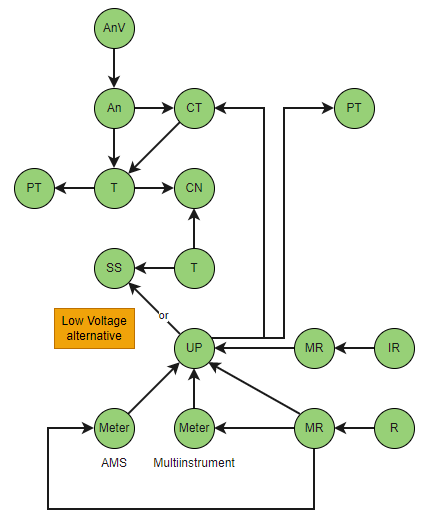

[#MG_MR]
= MeterReading specifications

*Version:* 2.1

[red]#When to use MeterReading#

[red]#Describe how to use MeterReading#

* [red]#Why we have chosen to use JSON#
* [red]#Associating classes when using json#

[red]#The following scenarios for the use of MeterReading are included in the DIGIN10 model:#

 * Reference data +
 _Reading types for all "consumption" will be reference data._
 ** ReadingType
 ** ReadingQualityType
 * UsagePoint
 ** Reading (kWh and kVAR)
 ** IntervalReading
 * Point-of-common-coupling
 ** Reading (kWh, kVAR, max kW)
 ** IntervalReading

The following classes will be included in later versions of the DIGIN10 model:

* EndDeviceEvent
* EndDeviceEventType

== Modeling example
See modelling examples in the figure below:

=== Figure abbreviations:
--
[cols="1,1", width=100%]
[#tab:abbr_meterReadingFigure] 
|===
|*Abbreviation*    |*Description*
|An | Analog 
|AnV | AnalogValue
|CN | ConnectivityNode
|CT | CurrentTransformer
|IR | IntervalReading
|MR | MeterReading
|PT | PotentialTransformer
|R | Reading
|SS |StationSupply
|T |Terminal
|UP | UsagePoint
|===
--

[red]#Should there be a description of the ReadingQualityType and ReadingType reference data?#